<div align="center">
  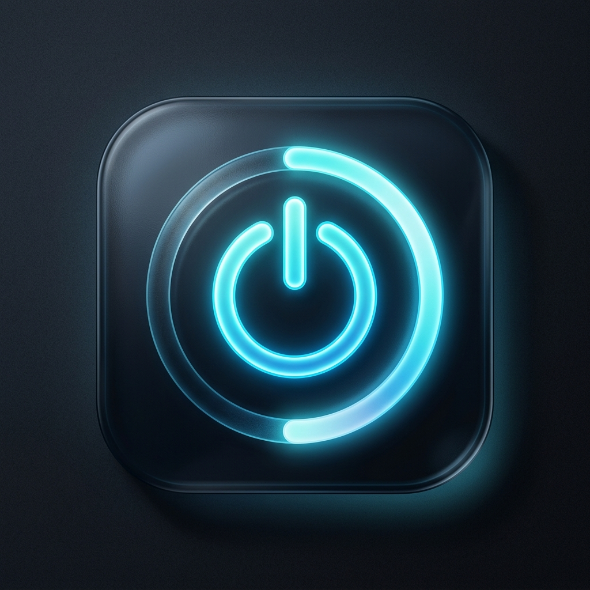

  <h1>Omni</h1>

  <p><strong>Windows için kişisel çalışma alanın.</strong></p>
  <p>Tarayıcı, yapay zekâ, notlar, dosya paylaşımı, uzaktan erişim, medya, alarm ve güç yönetimi — tek, sakin ve modern masaüstünde.</p>

  <p>
    
    
    
    
    
  </p>

  <p>
    <a href="https://github.com/geniusprr/Shutty/releases/latest"><strong>İndir</strong></a>
    · <a href="#uygulama-turu">Uygulama turu</a>
    · <a href="#teknoloji-ve-mimari">Mimari</a>
    · <a href="#geliştirme">Geliştirme</a>
  </p>
</div>

<p align="center">
  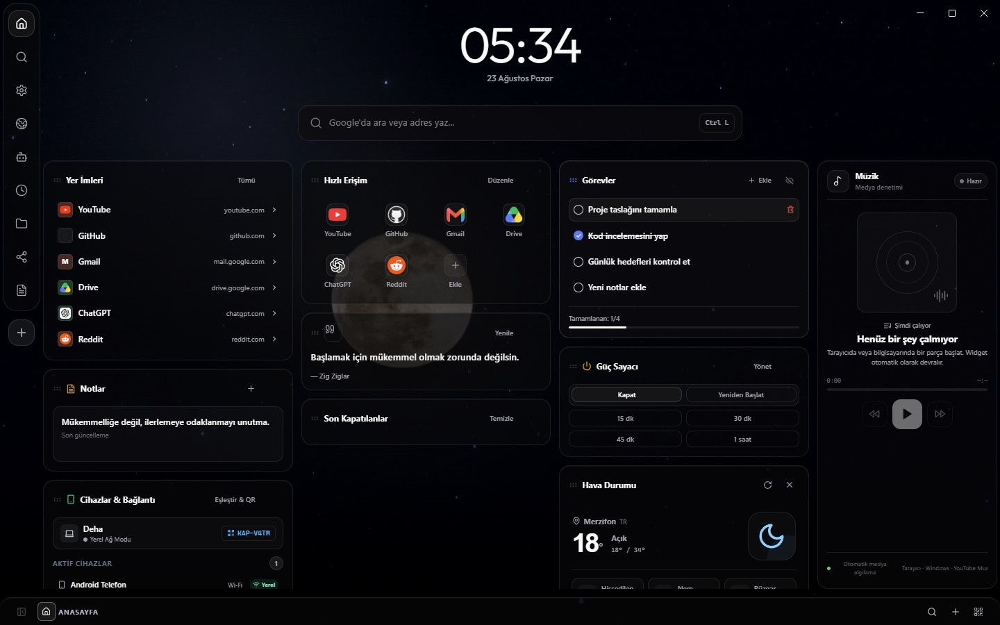
</p>

## Omni nedir?

Omni, Windows üzerinde günlük kullandığın araçları ayrı ayrı pencerelere dağıtmak yerine tek bir masaüstü kabuğunda birleştiren yerel bir çalışma alanıdır. Gerçek Chromium tabanlı tarayıcı sekmeleri, gömülü LibreChat, Markdown/Vault not sistemi, LocalSend uyumlu dosya aktarımı, mobil kumanda, güç zamanlayıcıları, alarmlar ve medya kontrolleri aynı arayüz diliyle birlikte çalışır.

Omni bir web sayfasını masaüstü uygulaması gibi gösteren basit bir wrapper değildir. Electron ana süreci tarayıcı yaşam döngüsünü, Windows entegrasyonlarını, yerel sunucuları, bildirimleri, dosya aktarımını ve sistem işlemlerini yönetirken React arayüzü bütün bu yetenekleri tek bir deneyimde toplar.

| Çalışma alanı | Ne sunuyor? | Öne çıkanlar |
| --- | --- | --- |
| **Ana Sayfa** | Günlük kontrol merkezi | Widget düzeni, hızlı erişim, görevler, hava, müzik, notlar, cihazlar |
| **Tarayıcı** | Yerleşik Chromium deneyimi | Gerçek sekmeler, geçmiş, indirmeler, izinler, medya ve oturum geri yükleme |
| **AI · LibreChat** | Yerel AI çalışma alanı | OpenRouter, OpenAI, Anthropic, Gemini, Mistral, Groq, Ollama ve custom endpoint |
| **Defter** | Yerel bilgi sistemi | Markdown, WYSIWYG, wikilink, backlink, graph, hızlı arama ve dosya ağacı |
| **Paylaşım** | Cihazlar arası aktarım | LocalSend/LAN, metin ve dosya gönderimi, eşleştirilmiş cihaz kuyruğu |
| **Mobil Kumanda** | PC'ye uzaktan erişim | Eşleştirme, ekran görüntüleme, mouse/klavye ve güç komutları |
| **Güç & Alarm** | Windows zamanlama araçları | Kapatma, yeniden başlatma, tek seferlik ve tekrarlayan alarmlar |
| **Ayarlar** | Tek merkezden yapılandırma | Temalar, bildirimler, cihazlar, bağlantılar ve başlangıç davranışı |

---

## Uygulama turu

### 1. Ana Sayfa — her şeyin başladığı yer

<p align="center"></p>

Ana sayfa, Omni'nin kontrol merkezi. Üç kolonlu sürüklenebilir widget düzeni; yer imlerini, hızlı erişim kısayollarını, görevleri, son notu, bağlı cihazları, güç sayacını, hava durumunu ve çalan medyayı aynı bakışta gösterir. Widget'lar kişiselleştirilebilir; sık kullanılan programlar ve web siteleri doğrudan buradan açılabilir.

- Google/adres araması için ana ekranda gerçek tarayıcı arama çubuğu ve `Ctrl + L` desteği.
- Program ve web sitesi kısayolları için özelleştirilebilir Hızlı Erişim alanı.
- Görev, not, cihaz, hava durumu, müzik ve güç widget'ları.
- Obsidyen, Pembe, Mor, Okyanus ve Açık tema seçenekleri.

### 2. Tarayıcı — uygulamanın içinde gerçek web

<p align="center">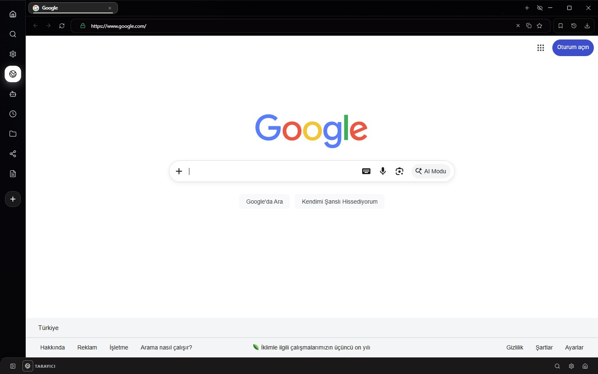</p>

Omni'nin tarayıcısı Electron'un native Chromium yüzeyini kullanır. Web içeriği React içinde taklit edilmez; her sekme gerçek bir tarayıcı yaşam döngüsüne sahiptir ve uygulama kabuğuyla senkron çalışır.

- Çoklu sekme, sabitleme, çoğaltma, sessize alma ve sekme oturumu geri yükleme.
- Geri/ileri, yenile, omnibox, favicon, popup ve fullscreen yönetimi.
- Geçmiş, indirmeler ve site izinleri için kalıcı yerel durum.
- Aktif medya algılama ve ana sayfadaki Müzik widget'ıyla senkron kontrol.
- Son sekme kapandığında Omni ana sayfasına doğal geri dönüş.

### 3. AI · LibreChat — model bağımsız çalışma alanı

<p align="center">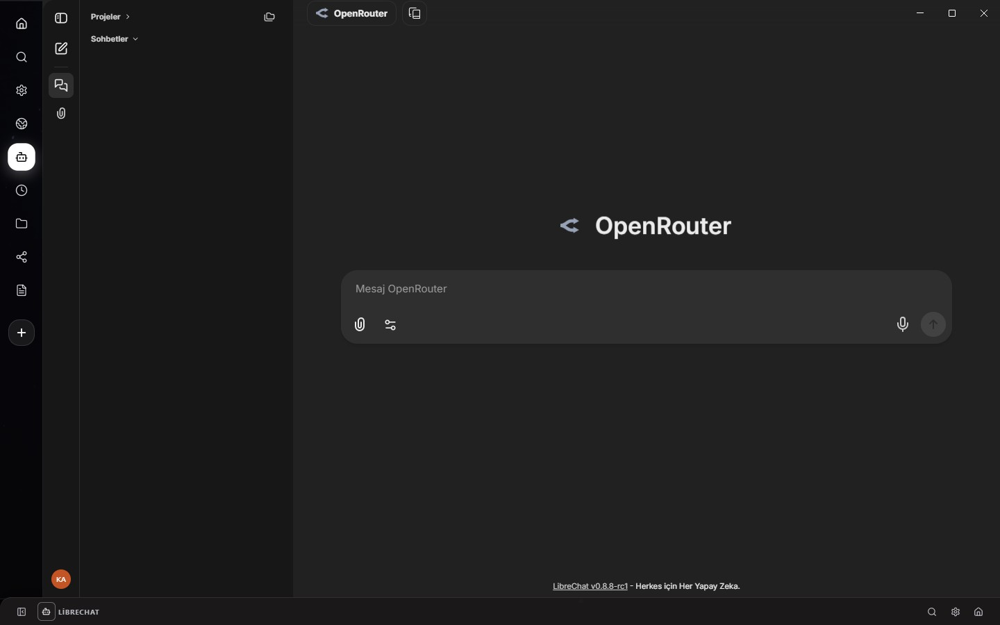</p>

Omni, resmi LibreChat istemcisini kendi yerel AI katmanıyla birlikte çalıştırır. Ayrı Docker kurulumu veya dışarıda açık bırakılması gereken bir LibreChat sunucusu gerekmeden uygulamanın içinde ayrı bir native çalışma alanı olarak açılır.

Desteklenen sağlayıcılar: **OpenRouter, OpenAI, Anthropic, Google Gemini, Mistral, Groq, Ollama** ve OpenAI uyumlu **custom endpoint**. Konuşmalar ve model yapılandırması yerel uygulama katmanı üzerinden yönetilir.

### 4. Güç & Zamanlayıcı — Windows planlarını sadeleştir

<p align="center">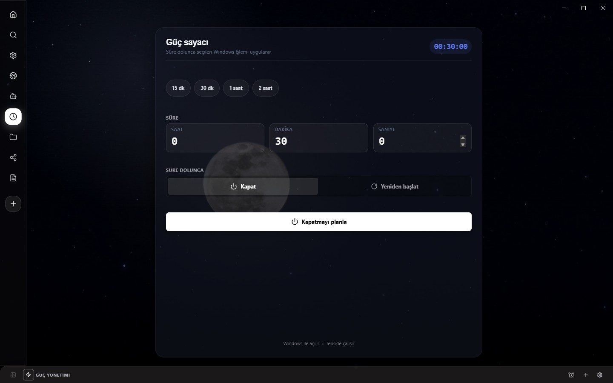</p>

Kapatma ve yeniden başlatma planlarını Windows'a doğrudan uygular. 15 dakika, 30 dakika, 1 saat ve 2 saat hazır süreleri kullanabilir veya saat/dakika/saniyeyi kendin belirleyebilirsin. Plan aktifken kalan süre görünür ve tek tıkla iptal edilebilir; pencere kapansa bile sistem planı devam eder.

### 5. Alarmlar — tek seferlik veya tekrarlayan

<p align="center">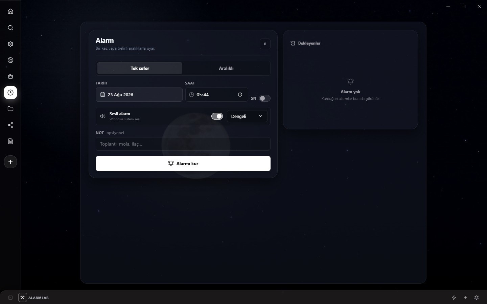</p>

Alarm sistemi yalnızca basit bir saat seçiciden ibaret değildir. Belirli bir tarihte tek seferlik alarm kurabilir, dakikalık/saatlik/günlük aralıklarla tekrar ettirebilir, 3/5/10 tekrar veya iptale kadar çalışma seçebilir ve Windows sistem sesleri arasında geçiş yapabilirsin. Alarm çalarken 5 dakika erteleme de desteklenir.

### 6. Defter & Vault — yerel, bağlantılı not sistemi

<p align="center">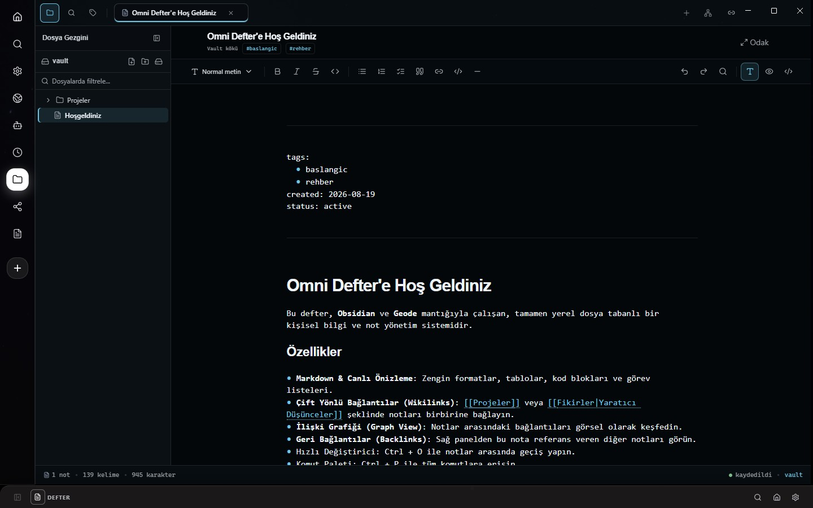</p>

Defter bölümü yerel dosya tabanlı bir kişisel bilgi alanıdır. Markdown dosyaların normal dosya olarak kalır; Omni bunun üzerine modern düzenleme, canlı biçimlendirme ve bağlantılı not araçlarını ekler.

- WYSIWYG odaklı Markdown düzenleme ve okuma modu.
- `[[wikilink]]`, backlink ve ilişki grafiği.
- Klasör/dosya ağacı, sekmeler, hızlı değiştirici ve içerik araması.
- Kod blokları, listeler, görevler, tablolar ve zengin metin araçları.
- Vault klasörünü Windows Explorer'da kullanmaya devam edebilme.

### 7. Dosya Paylaşımı — LocalSend mantığı, Omni deneyimi

<p align="center">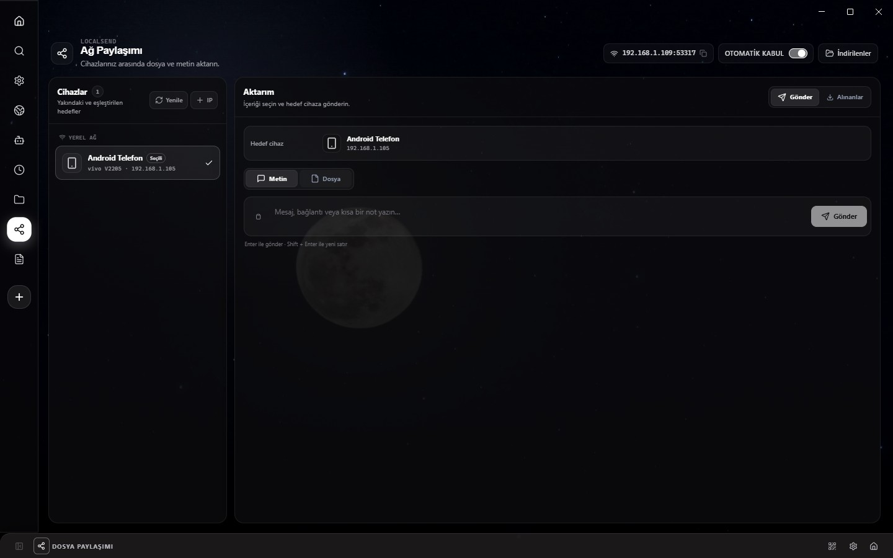</p>

Aynı Wi‑Fi ağındaki cihazları keşfet, hedefi seç ve metin ya da dosya gönder. Yerel cihazlar düşük gecikmeli LAN aktarımını kullanırken eşleştirilmiş cihazlar gerektiğinde bulut kuyruğu üzerinden de hedeflenebilir.

- Yerel ağ taraması ve manuel IP ile cihaz ekleme.
- Metin, bağlantı, fotoğraf, video, PDF ve diğer dosyaları gönderme.
- Sürükle-bırak dosya seçimi ve alınanlar geçmişi.
- Otomatik kabul seçeneği ve indirilenler klasörüne hızlı erişim.
- Yerel ve eşleştirilmiş cihazların tek cihaz listesinde görünmesi.

### 8. Uzak Bağlantı — telefonunu Omni kumandasına çevir

<p align="center">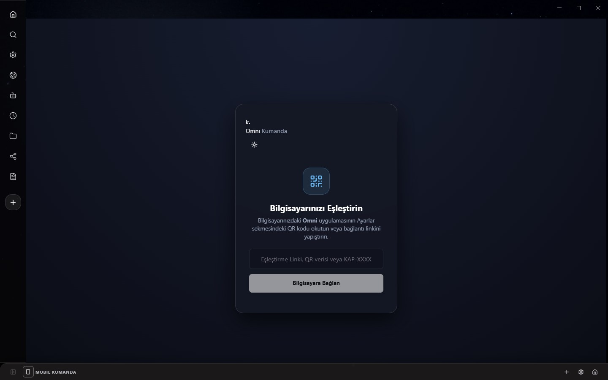</p>

Telefon veya başka bir cihaz QR/eşleştirme bağlantısıyla Omni'ye bağlanabilir. Yerel ağda PC ekranını görüntüleme, mouse hareketleri ve klavye girdisi gibi masaüstü kontrolleri; uzaktan güç komutları ve bildirim aktarımıyla aynı cihaz altyapısını paylaşır. Güvenilen cihazlar Ayarlar'dan ayrı ayrı iptal edilebilir.

### 9. Ayarlar — görünümden bağlantıya tek merkez

<p align="center">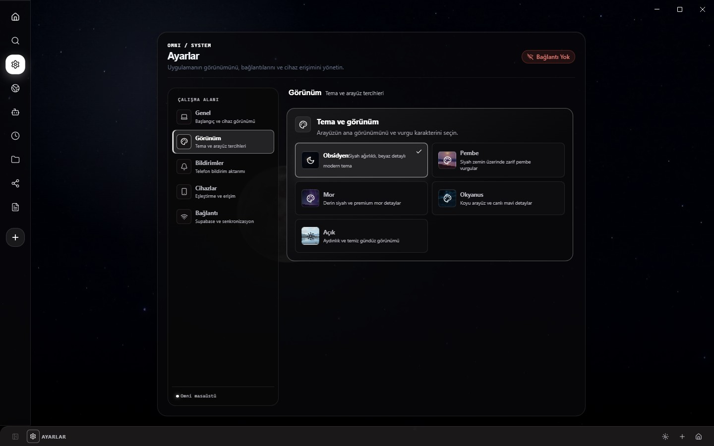</p>

Ayarlar ekranı beş net bölüme ayrılır: **Genel, Görünüm, Bildirimler, Cihazlar ve Bağlantı**. Windows ile otomatik başlatma, tema seçimi, PC bildirim aynalama, cihaz eşleştirme, mobil ekran kontrolü ve opsiyonel Supabase bağlantısı aynı alandan yönetilir.

### 10. Global Arama — `Ctrl + K` ile her yere ulaş

<p align="center">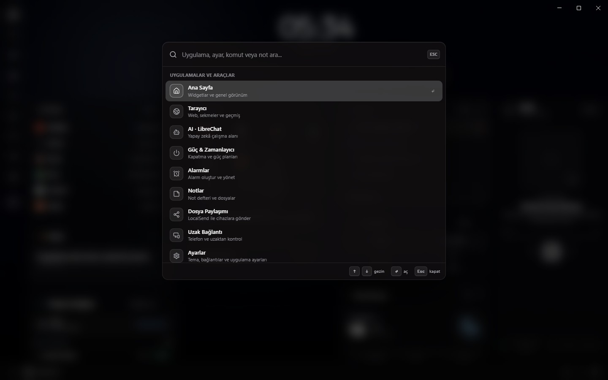</p>

Omni'nin hızlı değiştiricisi uygulama modlarını, ayarları, komutları ve Vault notlarını tek aramada bulur. Sonuç yoksa aynı alan web aramasına dönüşür. Klavyeden `↑` / `↓`, `Enter` ve `Esc` ile tamamen mouse kullanmadan gezilebilir.

---

## Yerel öncelikli tasarım

Omni'nin temel işlevleri bilgisayarın üzerinde çalışır. Tarayıcı oturumu, notlar, alarm ve uygulama durumu yerel çalışma alanında tutulur; yerel dosya paylaşımı ve mobil ekran bağlantısı LAN üzerinden çalışabilir. Supabase tabanlı uzaktan eşleştirme/senkronizasyon ise **isteğe bağlıdır** ve yalnızca kullanıcı yapılandırdığında devreye girer.

Uyumluluğu korumak için bazı dahili kimlikler ve veri yolları hâlâ `kapanis` adını taşır. Bu, eski kurulumların yerel verilerini, derin bağlantılarını ve eşleştirmelerini kırmadan görünen ürün adının **Omni** olarak değişmesini sağlar.

## Teknoloji ve mimari

| Katman | Teknoloji / yaklaşım |
| --- | --- |
| Masaüstü kabuğu | Electron 43, native Windows pencere ve tray entegrasyonu |
| Arayüz | React 18, TypeScript 5.7, Vite 6, Radix/shadcn tabanlı bileşenler |
| Tarayıcı | Chromium `BrowserView` / native `webContents`, ayrı sekme yaşam döngüsü |
| AI | Bundled LibreChat istemcisi + yerel `AiStore` + çoklu sağlayıcı desteği |
| Notlar | Yerel Vault, CodeMirror 6, Markdown parser, wikilink/backlink/graph |
| Dosya aktarımı | LAN discovery + LocalSend akışı + eşleştirilmiş cihaz transfer kuyruğu |
| Mobil / Remote | Yerel HTTP/WebSocket katmanı, güvenilen cihaz sistemi, Android companion |
| Opsiyonel bulut | Supabase Realtime ve eşleştirme altyapısı |
| Test | TypeScript build, birim testleri, Electron browser lifecycle smoke testleri |

## Kurulum

Windows kurulum paketleri GitHub Releases üzerinden yayınlanır:

**[→ En güncel Omni sürümünü indir](https://github.com/geniusprr/Shutty/releases/latest)**

> Windows installer şu anda kod imzalı değilse SmartScreen “bilinmeyen yayıncı” uyarısı gösterebilir. Kaynaktan derlemeyi tercih ediyorsan aşağıdaki geliştirme adımlarını kullanabilirsin.

### Gereksinimler

- Windows 10 veya Windows 11
- Kaynaktan geliştirme için Node.js 22+
- Android companion derlemek istersen Android Studio / uygun Android SDK

## Geliştirme

```powershell
npm ci
npm run dev
```

Yararlı komutlar:

```powershell
npm run build          # TypeScript + Vite + Electron build
npm test               # Birim testleri
npm run test:browser   # Gerçek Electron/Chromium lifecycle smoke testi
npm run dist           # Windows NSIS installer
```

`npm run dev:ui` yalnızca React renderer'ını açar. Gerçek tarayıcı yüzeyi, Windows entegrasyonu, LibreChat ve sistem özellikleri için `npm run dev` kullan.

## Android companion

`mobil/` klasörü Omni'nin Android companion uygulamasını içerir. Mobil istemci eşleştirilmiş bilgisayarlara bağlanmak, güç komutları göndermek, bildirim almak, dosya paylaşmak ve izin verildiğinde PC ekranını kontrol etmek için masaüstü uygulamasıyla birlikte çalışır.

## Proje yapısı

```text
src/                 React arayüzü, özellikler ve tasarım sistemi
electron/            Windows/Electron ana süreç servisleri
shared/              Renderer ↔ Electron ortak sözleşmeleri
mobil/               Android companion uygulaması
supabase/             Opsiyonel remote/realtime migration'ları
vendor/librechat-*    Omni ile paketlenen LibreChat istemcisi
docs/images/          Bu README'de kullanılan gerçek Omni ekran görüntüleri
```

## Lisans

MIT — ayrıntılar için [`LICENSE`](LICENSE) dosyasına bakın.

---

<div align="center">
  <strong>Omni</strong><br />
  <sub>Bir sürü küçük araç yerine, tek bir kişisel çalışma alanı.</sub>
</div>
